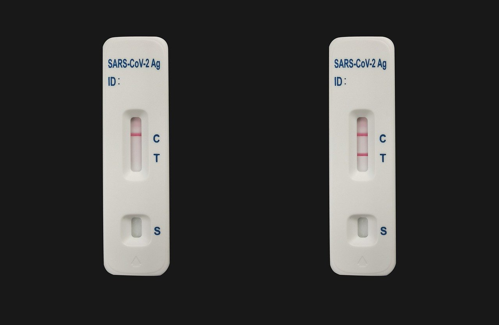

# Auswertung von Lateral Flow Assays

Lateral Flow Assays (LFA) sind meist Antikörperbasierte Schnelltests, die häufig in der Medizin eingesetzt werden. Prominente Beispiele sind Schwangerschaftstests oder Corona-Schnelltests. Gemeinsam haben sie, dass man eine Probe an einer Stelle aufträgt (häufig als "sample" oder kurz "s" markiert), die sich dann über einen Testbereich verteilt und nach einiger Zeit zu einem oder zwei Signalen führt: Auf jeden Fall sollte ein Farbumschlag im Kontroll-Bereich ("control" oder kurz "c") erfolgen, der zeigt, dass der Test an sich funktioniert. Bei einem positiven Ergebnis erfolgt auch ein Farbumschlag im Test-Bereich ("test" oder kurz "t"). 

Beispielhaft ist hier ein Corona-Schnelltest (fotografiert von [Alexandra Koch](https://pixabay.com/users/alexandra_koch-621802/)) zu sehen, links mit negativen Ergebnis und rechts mit positiven Ergebnis:



Die Farbumschläge sind allerdings nicht immer so deutlich, wie in diesem Beispielbild, und zum Teil schwer zu deuten - während bei Corona-Tests jeder Schimmer einer Linie bei "t" als positiv gewertet wird, gibt es viele Tests bei denen das Verhältnis der Farbintensität bei "c" und "t" über einem bestimmten Schwellenwert liegen muss, was mit bloßem Auge nur schwer einzuschätzen ist. Zudem verblassen die Farben nach einiger Zeit. Um eine objektive Einschätzung des Ergebnisses und Dokumentation anzubieten, ist also ein computergestütztes Auslesen der Tests sinnvoll.

In dieser Aufgabe implementieren Sie ein kleines Programm, welches Bilder von LFAs einliest, die Farbumschläge analysiert und ein Ergebnis – positiv oder negativ – anzeigt. Dabei gehen Sie davon aus, dass das Bild von einem Lesegerät stammt, welches die Tests reproduzierbar auf die gleiche Art einliest. Sie bekommen also eine Konfigurationsdatei, in der die Koordinaten für die Test- und Kontrollstreifen stehen, anstatt dass Sie automatisch die Streifen im Bild finden müssten.

Die Beispielbilder in dieser Aufgabe stammen aus der [Publikation von Yafei Hou et al.](https://doi.org/10.1186/s11671-017-2078-9) über ein Smartphone-basiertes Auslesesystem für LFAs.

## Benotung

Bei den automatischen Tests können Sie bis zu 65 Punkte erreichen:
* ```Configuration```: 25 Punkte
* ```FormatException```: 15 Punkte
* ```LFAImage```: 25 Punkte

Für die Benotung der GUI-Entwicklung laden Sie am Ende 6 Bilder hoch. Für jedes dieser Bilder gibt es 5 weitere Punkte, also insgesamt 30 Punkte für das GUI.

Zudem gibt es direkt über dem Bereich für Ihre GUI-Bilder eine kleine Verständnisfrage zu beantworten. Für diese gibt es weitere 5 Punkte, so dass für alles zusammen 100 Punkte erreicht werden können.

## FormatException

Implementieren Sie zunächst zum Behandeln von Formatfehlern eine Klasse ```FormatException```, die von ```Exception``` ableitet und die folgenden Methoden enthält:

* ```public FormatException(String line, String error)```: Constructor.
* ```public String getLine()```: Gibt den Inhalt der Zeile, in der der Fehler aufgetreten ist, zurück.
* ```public String getError()```: Gibt die Beschreibung des Fehlers zurück.
* ```public String getMessage()```: Überschreibt ```getMessage()``` aus ```Exception```. Gibt die folgende Message zurück: "Wrong format in line '<Zeileninhalt>': <Fehlerbeschreibung>.".

## Configuration

Implementieren Sie dann zum Einlesen und Verwalten der Koordinaten-Informationen eine Klasse ```Configuration```. Das Format der einzulesenden Konfigurationsdatei ist äußerst simpel: Jede Zeile besteht aus einem Namen gefolgt von Werten, getrennt durch Leerzeichen. Der Name kann sein:
* "control" oder "test", gefolgt von 4 Koordinaten. Die Koordinaten beschreiben zwei Punkte: Die obere linke Ecke sowie die untere rechte Ecke des Bereichs, jeweils erst x und dann y
* "ratio", gefolgt von einem double-Wert.

Eine Konfigurationsdatei mit für die Beispielbilder sinnvollen Daten finden Sie in [data/coordinates.txt](Bilder/coordinates.txt).

Implementieren Sie die folgenden Methoden in ```Configuration```:

* ```public Configuration(File configfile) throws IOException, FormatException```: Constructor. Die Exceptions sind weiter unten beschrieben.
* ```public int[] getControlCoordinates()```: Gibt die Koordinaten der Kontrolle als ```int[]``` zurück.
* ```public int[] getTestCoordinates()```: Gibt die Koordinaten des Tests als ```int[]``` zurück.
* ```public double getRatio()```: Gibt den Cutoff für die Signalintensität zwischen Test und Kontrolle zurück.
* ```public boolean isBorderEnabled()```: Gibt zurück, ob eine Signalkorrektur erfolgen soll. Standardmäßig ```false```.
* ```public void setBorderEnabled(boolean enabled)```: Stellt ein, ob eine Signalkorrektur erfolgen soll. 
* ```public int getBorderWidth()```: Gibt die Höhe des Bereichs für die Signalkorrektur zurück. Erstmal immer 10. 

Der Constructor soll unter den folgenden Bedingungen Exceptions werfen:
* Falls beim Einlesen oder Öffnen der Datei irgendwas nicht stimmt: Die entsprechende ```IOException```.
* Falls eine Zeile nicht dem geforderten Format entspricht: Eine ```FormatException``` mit der entsprechenden Zeile und dem folgenden Fehler:
    * Falls zu wenige Elemente in der Zeile sind: 
      * Für test: "wrong number of fields (expected 5: test <upper left x> <upper left y> <lower right x> <lower right y>)"
      * Für control: "wrong number of fields (expected 5: control <upper left x> <upper left y> <lower right x> <lower right y>)"
      * Für ratio: "wrong number of fields (expected 2: ratio <ratio>)"
    * Falls der Name nicht "control", "test" oder "ratio" ist: "unknown name '<gefundener Name>'"
    * Falls eine der Koordinaten nicht als Integer geparst werden kann: "one of the coordinates could not be parsed as an integer"
    * Falls das ratio nicht als Double geparst werden kann: "ratio could not be parsed as a double" 
  

## LFAImage

Um das Bild von einem LFA zu verwalten und die nötigen Berechnungen darauf durchzuführen, implementieren Sie dann eine Klasse ```LFAImage```. Diese soll folgende Methoden enthalten:

* ```public LFAImage(File imagefile) throws IOException```: Constructor, liest das Bild in ```imagefile``` als ```BufferedImage``` ein. Falls beim Einlesen eine ```IOException``` auftritt, soll diese weitergeworfen werden.
* ```public BufferedImage getImage()```: Gibt das BufferedImage für das eingelesene Bild zurück.
* ```public double getAverageIntensity(int[] coords)```: Gibt die durchschnittliche Signalintensität aller Bildpunkte innerhalb der übergebenen Koordinaten zurück (jeweils inklusive der angegebenen Punkte). Die Signalintensität eines Pixels ist dabei definiert als ```(256-Rotwert) + (256-Grünwert) + (256-Blauwert)```, da ein dunklerer Streifen (niedrigere Farbwerte) einer höheren Signalintensität entspricht. Für die Berechnung sollen nur Bereiche einbezogen werden, die auch im Bild existieren - liegt eine der Koordinaten außerhalb des Bildes (kleiner 0 oder größer als die Bildbreite bzw. -Höhe), dann werden nur die Pixel in die Berechnung einbezogen, die auch tatsächlich innerhalb des Bildes liegen.
* ```public double getAverageIntensityCorrected(int[] coords, int border)```: Gibt die durchschnittliche Signalintensität korrigiert um die Intensität in der Umgebung aus. Dafür wird von der durchschnittlichen Signalintensität im übergebenen Bereich die durchschnittliche Signalintensität in den jeweils ```border``` Pixeln darüber und darunter abgezogen.

Hier nochmal die Berechnungen visualisiert. Wird im Bild [data/LFA-1.png](data/LFA-1.png) ```getAverageIntensity(new int[] {7, 15, 24, 24})``` aufgerufen, so wird die durchschnittliche Intensität in dem blau eingerahmten Bereich (inklusive der Pixel die durch den Rahmen überdeckt sind) berechnet:


Wird hingegen ```getAverageIntensityCorrected(new int[] {7, 15, 24, 24}, 10)``` aufgerufen, wird von dem Wert noch die durchschnittliche Intensität der zwei gelb eingerahmten 10 Pixel hohen Bereiche dadrüber und dadrunter abgezogen:


## GUI

Nun haben Sie alles, was Sie für die Analyse brauchen - es ist an der Zeit, das GUI zu implementieren.

### ImagePanel

Implementieren Sie für die Darstellung eines LFA-Bildes eine Klasse ```ImagePanel```, die von ```JPanel``` ableitet und die folgenden Methoden enthält:

* ```public ImagePanel()```: Constructor. Setzen Sie hier der Einfachkeit halber die Größe starr auf 31x78 Pixel, das ist die Größe der Bilder im data-Verzeichnis.
* ```public void setImage(LFAImage image)```: Setzt das anzuzeigende ```LFAImage```. Sollte die Darstellung aktualisieren.
* ```public void setConfig(Configuration config)```: Setzt die Konfiguration. Sollte die Darstellung aktualisieren.
* ```public LFAImage getImage()```: Gibt das angezeigte ```LFAImage``` zurück.
* ```public void paintComponent(Graphics g)```: Überschreibt die Methode aus ```JPanel```:
    * Falls weder eine Konfiguration noch ein Bild gesetzt sind, sollte einfach nur auf weißem Hintergrund "N/A" stehen.
    * Falls eine Konfiguration gesetzt ist, soll ein blauer Kasten um die Bereiche des Tests und der Kontrolle gezeichnet werden. 
    * Falls in der Konfiguration ```isBorderEnabled()``` ```true``` ist, sollen zusätzlich schwarze Kästchen um die für die Signalkorrektur verwendeten Bereiche gezeichnet werden.
    * Falls ein Bild gesetzt ist, soll dieses dargestellt werden.

### MainFrame

Die Klasse ```MainFrame``` soll von ```JFrame``` ableiten und das Hauptfenster darstellen. Dabei sollen das GUI folgende Elemente enthalten:
* Ein ```JMenuBar``` mit einem ```JMenu``` "File" und den folgenden ```JMenuItem```s:
    * "Load configuration": Zeigt ein Popup zum Laden einer Text-Datei, liest diese als ```Configuration``` ein und setzt sie im ```ImagePanel```
    * "Load LFA image": Zeigt ein Popup zum Laden einer Bild-Datei, liest diese als ```LFAImage``` ein und setzt es im ```ImagePanel```
    * "Exit": Beendet das Programm
* Ein ```ImagePanel``` auf der rechten Seite (ich empfehle ein ```BorderLayout``` und das ```ImagePanel``` an der Position ```BorderLayout.CENTER```)
* Label zur Darstellung des ratio-cutoffs, des berechneten signal ratio sowie des Ergebnisses (positiv, falls ratio > ratio-cutoff, sonst negativ) und eine Checkbox zum Einstellen, ob die Ränder in die Berechnung mit einbezogen werden sollen – siehe Screenshots unten. Ich empfehle ein ```JPanel``` mit ```GridBagLayout``` in dem die Labels und die Checkbox hinzugefügt werden und welches an der Position ```BorderLayout.WEST``` dem ```MainFrame``` hinzugefügt wird.

Wichtig ist, dass bei jeder relevanten Veränderung (laden eines neuen Bildes, laden einer neuen Konfigurationsdatei, Verändern der Checkbox bei "Background correction") die Berechnung automatisch neu ausgeführt wird.

Falls beim Laden einer Datei ein Fehler auftritt, soll dieser über ein Popup mit ```getMessage()``` der aufgetretenen Exception angezeigt werden.

### Screenshots

Hier finden Sie Screenshots von dem erwarteten Verhalten des Programms (es muss wie besprochen bei Ihnen nicht pixelgenau identisch aussehen, aber von der Idee her soll es so funktionieren):

#### Frisch geöffnetes Programm


#### Fehler beim Laden einer Konfigurationsdatei


#### Nur Konfiguration geladen (keine background correction gesetzt)


#### Nur Konfiguration geladen (background correction gesetzt)


#### Bild und Konfiguration geladen (background correction gesetzt)


#### Bild und Konfiguration geladen (keine background correction gesetzt)

Beachten Sie, dass sich das angezeigte Intensity ratio durch das Ausschalten der background correction verändert.


### LFAAnalysis

Die Main-Klasse ```LFAAnalysis``` braucht nur eine ```main```-Methode enthalten, in der ein ```MainFrame``` erstellt und sichtbar gemacht wird - sie ist nur die Einstiegsklasse in das Programm.

### GUI-Abgabe

Wie in den Hausaufgaben gibt es für das GUI keine automatisierten Tests. Ersetzen Sie stattdessen die Dateien "result1.png"-"result6.png" durch Screenshots von Ihrem Programm, die die gleichen Zustände zeigen (in der gleichen Reihenfolge) wie die Beispielscreenshots oben. Ihre Screenshots sollten dann hier erscheinen. Für jeden der Screenshots gibt es **5 Punkte**.

Verwenden Sie dabei **die Datei LFA-1.png**! Beschreiben Sie hier kurz, ob wieso sich das Ergebnis der Berechnung (positiv/negativ) bei dieser Datei verändert, wenn die Hintergrundkorrektur ein- bzw. ausgeschaltet wird (dafür gibt es auch **5 Punkte**, also bitte nicht übersehen):

```text
Das Ergebnis der Berechnung auf der Datei LFA-1.png <IHR TEXT HIER>
```

#### Lösung: Frisch geöffnetes Programm


#### Lösung: Fehler beim Laden einer Konfigurationsdatei


#### Lösung: Nur Konfiguration geladen (keine background correction gesetzt)


#### Lösung: Nur Konfiguration geladen (background correction gesetzt)


#### Lösung: Bild und Konfiguration geladen (background correction gesetzt)


#### Lösung: Bild und Konfiguration geladen (keine background correction gesetzt)


# Zusatzaufgabe

Für bis zu 10 Bonuspunkte können Sie folgende Zusatzaufgabe bearbeiten: Erweitern Sie das Programm so, dass anstatt nur einer Bilddatei mehrere ausgewählt werden können. Fügen Sie Ihrem Programm zudem unter dem ```ImagePanel``` zwei Buttons zum Blättern hinzu, mit denen jeweils das nächste bzw. das vorherige Bild angezeigt werden können. Bei Klick auf einen dieser Buttons soll neben der Darstellung im ```ImagePanel``` natürlich auch die Anzeige der berechneten Ergebnisse aktualisiert werden. Hinweis: Das lässt sich recht einfach durch eine Erweiterung von ```MainFrame``` lösen, ohne ```ImagePanel``` zu verändern. 

Fügen Sie als Lösung aussagekräftige Screenshots im Ordner "Bilder" hinzu und erweitern Sie die README.md so, dass diese unter diesem Satz angezeigt werden (ähnlich wie die Lösungen des Pflichtteils weiter oben). 